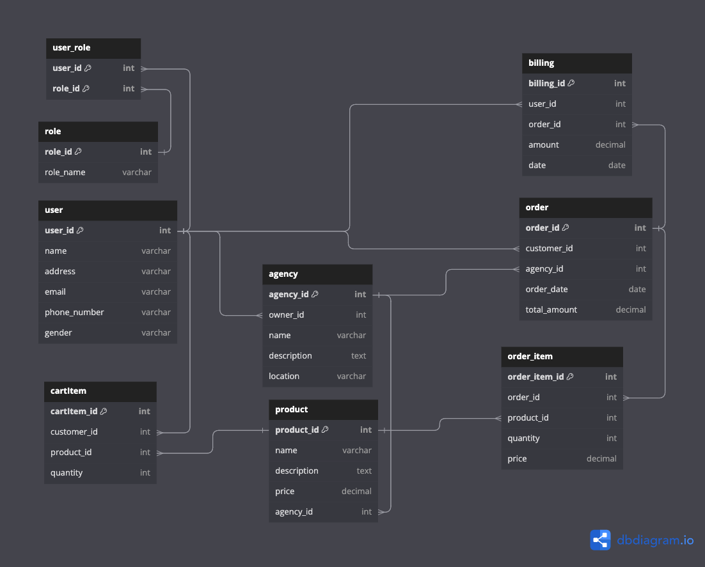

# HMALL

## Introduction

This is a simple e-commerce backend system. It is built with Spring Boot.

## Features

- User management
- Product management
- Order management
- Payment management
- Shopping cart management

## Technologies

- Java 17
- Spring Boot 3
- Spring Security
- Spring Data JPA
- MySQL
- Redis

## How to run

1. Clone the repository
2. Create a MySQL database (can be done with docker)
3. Create a Redis server (can be done with docker)
4. Run the application

For create mysql and redis with docker, i have already provide the docker-compose file. You can run it with this command:

```bash
docker-compose up
```

## Database

ERD provided in `docs/erd.png`, powered by [dbdiagram.io](https://dbdiagram.io/).



## API documentation

The documentation is generated with OPENAPI.
It is available at [doc](http://localhost:8801/doc.html#/home).

## Project structure

For this small project, I use layered project architecture.
Main packages:

- `controller`: REST controllers
- `dto`: Data transfer objects
- `service`: Business logic
- `repository`: Data access (JPA)
- `model`: Entity/Form/Variable Object classes

## Project Status

This project is still under development. There are still many features to be added, and many improvements to be made.

## TODO

- [ ] Add unit tests
- [ ] Add integration tests
- [ ] Add more features
- [ ] Add more documentation
- [ ] Add more error handling
- [ ] Add more validation
- [ ] Add more security
- [ ] Refactor to microservices
